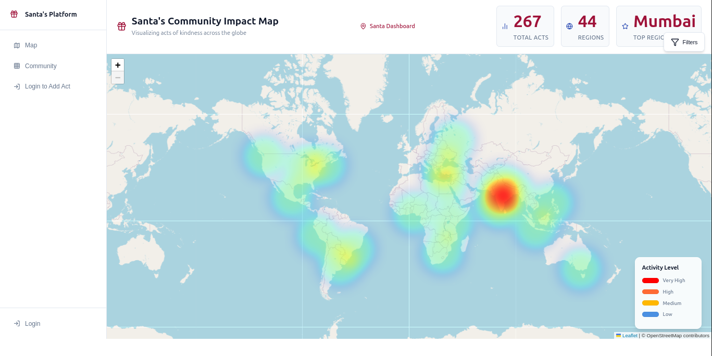
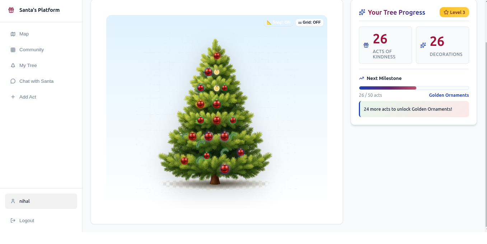
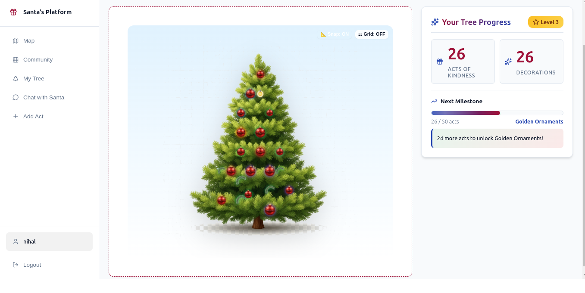
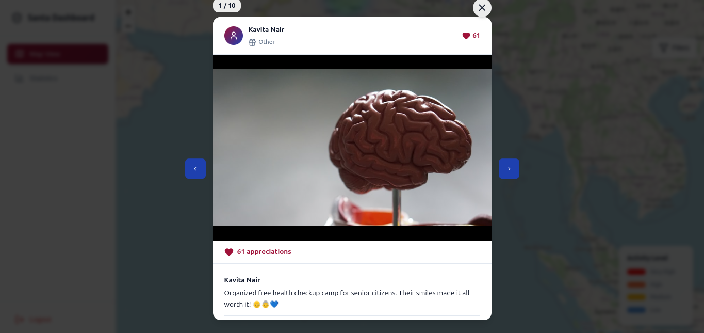
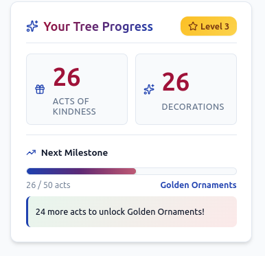

# 🎄 Christmas Tree of Kindness

A gamified web application that encourages acts of kindness by allowing users to build and decorate their own virtual Christmas tree. Each act of kindness adds decorations to the tree, creating a beautiful visual representation of generosity and compassion.


## 📖 Project Description

Christmas Tree of Kindness is a full-stack web application that gamifies acts of kindness. Users can submit acts of kindness they've performed, and each submission unlocks decorations on their personalized Christmas tree. The application features:

- **Interactive Map Visualization**: View all acts of kindness on a global map with heat mapping
- **Personalized Christmas Trees**: Each user has their own tree that grows and decorates as they perform more acts
- **Progress Tracking**: Milestone-based progress system with tree levels (1-5)
- **Community Dashboard**: Admin dashboard to view statistics and analytics
- **Beautiful UI**: Modern, responsive design with smooth interactions

## ✨ Features

### User Features
- 🔐 **User Authentication**: Secure registration and login system
- 🎁 **Submit Acts of Kindness**: Record acts with location, category, and description
- 🌍 **Interactive Map View**: Visualize acts on a world map with heat mapping
- 🎄 **Personalized Tree**: Build your own Christmas tree with decorations
- 🎨 **Tree Customization**: Edit mode to drag and drop decorations on your tree
- 📊 **Progress Tracking**: Track milestones and see your tree level grow
- 🔍 **Search & Filter**: Search acts by location, category, or time period
- 📈 **Statistics**: View total acts, decorations, and progress metrics

### Admin Features
- 📊 **Santa Dashboard**: Admin dashboard with password protection
- 📈 **Analytics**: View statistics, category distribution, and regional data
- 📥 **Data Export**: Export acts data in CSV or JSON format
- 🗺️ **Map Analytics**: Interactive map with heat visualization
- 📍 **Region Analysis**: View top regions and cities

### Tree Features
- 🌟 **Multiple Decoration Types**: Ornaments, stars, lights, garlands, gifts, and snowflakes
- 🎯 **Milestone Unlocks**: 
  - 3 acts: Colored Ornaments
  - 5 acts: Star Topper
  - 10 acts: Lights
  - 15 acts: Garland
  - 25 acts: Snowflakes
  - 50 acts: Golden Ornaments
  - 100 acts: Special Tree Topper
- 🎚️ **Tree Levels**: 5 levels that unlock based on total acts (1-10, 11-25, 26-50, 51-100, 100+)
- ✏️ **Edit Mode**: Drag and drop decorations to customize your tree
- 🎨 **Auto Placement**: Automatic decoration placement with manual override

## 🛠️ Tech Stack

### Backend
- **Django 4.2.7**: Python web framework
- **Django REST Framework 3.14.0**: Building RESTful APIs
- **Django CORS Headers 4.3.1**: Handling CORS for frontend communication
- **Python 3.12+**: Programming language
- **SQLite**: Database (can be easily migrated to PostgreSQL)

### Frontend
- **React 19.2.3**: UI library
- **Vite 6.4.1**: Build tool and dev server
- **React Router DOM 6.30.2**: Client-side routing
- **Axios 1.13.2**: HTTP client for API requests
- **Leaflet 1.9.4**: Interactive maps
- **Leaflet.heat 0.2.0**: Heat map visualization
- **Recharts 3.6.0**: Data visualization and charts
- **Lucide React 0.562.0**: Icon library
- **CSS3**: Custom styling with CSS variables

### Development Tools
- **Git**: Version control
- **Vite**: Fast build tool and HMR
- **ESLint**: Code linting

## 📸 Screenshots

### Home Page - Interactive Map

*View all acts of kindness on an interactive world map with heat visualization*

### My Tree Page

*Your personalized Christmas tree with decorations unlocked by acts of kindness*

### Edit Mode

*Drag and drop decorations to customize your tree layout*

### Act Details View

*Click on any act on the map to view detailed information about acts of kindness, including location, category, description, and nearby acts*

### Santa Dashboard

*Admin dashboard with statistics, charts, and data export*

### Progress Tracking

*Track your milestones and see your next goals*

> **Note**: Add your screenshots to the `screenshots/` folder with the filenames shown above. The images will be displayed once you add them to the repository.

## 🚀 Setup Instructions

### Prerequisites
- Python 3.12 or higher
- Node.js 18+ and npm
- Git

### Backend Setup

1. **Clone the repository**
   ```bash
   git clone <repository-url>
   cd christmas
   ```

2. **Create and activate virtual environment**
   ```bash
   cd backend
   python3 -m venv venv
   source venv/bin/activate  # On Windows: venv\Scripts\activate
   ```

3. **Install dependencies**
   ```bash
   pip install -r requirements.txt
   ```

4. **Run migrations**
   ```bash
   python manage.py migrate
   ```

5. **Create superuser (optional, for admin access)**
   ```bash
   python manage.py createsuperuser
   ```

6. **Run the development server**
   ```bash
   python manage.py runserver
   ```
   The backend API will be available at `http://localhost:8000`

### Frontend Setup

1. **Navigate to frontend directory**
   ```bash
   cd ../frontend
   ```

2. **Install dependencies**
   ```bash
   npm install
   ```

3. **Start the development server**
   ```bash
   npm run dev
   ```
   The frontend will be available at `http://localhost:3000`

### Configuration

The backend is configured to accept requests from `http://localhost:3000` by default. If you need to change this, update the `CORS_ALLOWED_ORIGINS` and `CSRF_TRUSTED_ORIGINS` in `backend/santa_project/settings.py`.

### Build for Production

**Frontend:**
```bash
cd frontend
npm run build
```
The built files will be in the `frontend/build/` directory.

**Backend:**
For production, configure:
- Set `DEBUG = False` in settings.py
- Use a production database (PostgreSQL recommended)
- Set up proper static file serving
- Configure environment variables for SECRET_KEY

## 📁 Project Structure

```
christmas/
├── backend/                 # Django backend
│   ├── acts/               # Acts of kindness app
│   ├── user_auth/          # User authentication
│   ├── tree/               # Tree and decorations logic
│   ├── admin_auth/         # Admin authentication
│   ├── santa_project/      # Django project settings
│   ├── manage.py
│   └── requirements.txt
│
├── frontend/               # React frontend
│   ├── src/
│   │   ├── components/     # React components
│   │   ├── pages/          # Page components
│   │   ├── services/       # API services
│   │   ├── contexts/       # React contexts
│   │   └── utils/          # Utility functions
│   ├── public/             # Static assets
│   │   └── assets/         # Tree and decoration images
│   ├── package.json
│   └── vite.config.js
│
└── README.md
```

## 🔑 API Endpoints

### Authentication
- `POST /api/auth/register/` - User registration
- `POST /api/auth/login/` - User login
- `POST /api/auth/logout/` - User logout

### Acts
- `GET /api/acts/` - List all acts (with filters)
- `POST /api/acts/` - Create new act
- `GET /api/acts/stats/` - Get statistics
- `GET /api/acts/nearby/` - Get nearby acts
- `GET /api/acts/region/` - Get region data

### Tree
- `GET /api/tree/my-tree/` - Get user's tree
- `GET /api/tree/decorations/` - List decorations
- `PUT /api/tree/decorations/{id}/` - Update decoration position
- `POST /api/tree/decorations/` - Create decoration

### Admin
- `POST /api/admin/login/` - Admin login
- `GET /api/admin/dashboard/` - Dashboard data

## 🎮 Usage

1. **Register/Login**: Create an account or login to get started
2. **Submit Acts**: Click "Add Act" to submit your acts of kindness
3. **View Map**: Browse the interactive map to see acts from around the world
4. **Build Your Tree**: Each act unlocks decorations on your tree
5. **Customize**: Use Edit Mode to drag decorations to your preferred positions
6. **Track Progress**: Monitor your milestones and tree level
7. **Admin Access**: Use the Santa Dashboard (password protected) for analytics

## 🗺️ Roadmap

Potential future features:
- [ ] Tree image export/sharing
- [ ] Public tree gallery
- [ ] Social features (friends, leaderboards)
- [ ] Achievement badges
- [ ] Daily challenges
- [ ] Tree themes/customization
- [ ] Mobile app

## 📝 License

This project is part of a hackathon submission. Please check the license file for details.

## 👥 Contributors

- Your Name/Team

## 🙏 Acknowledgments

- Django and React communities
- Leaflet for map functionality
- All the open-source libraries that made this possible

---

Made with ❤️ and 🎄 for spreading kindness around the world!
