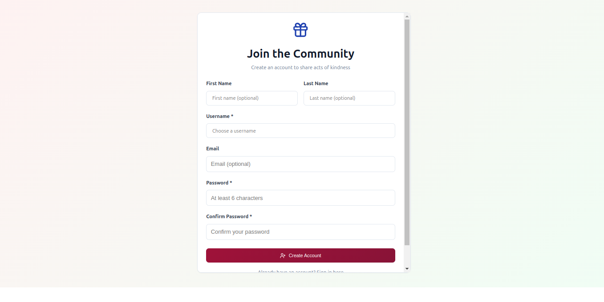
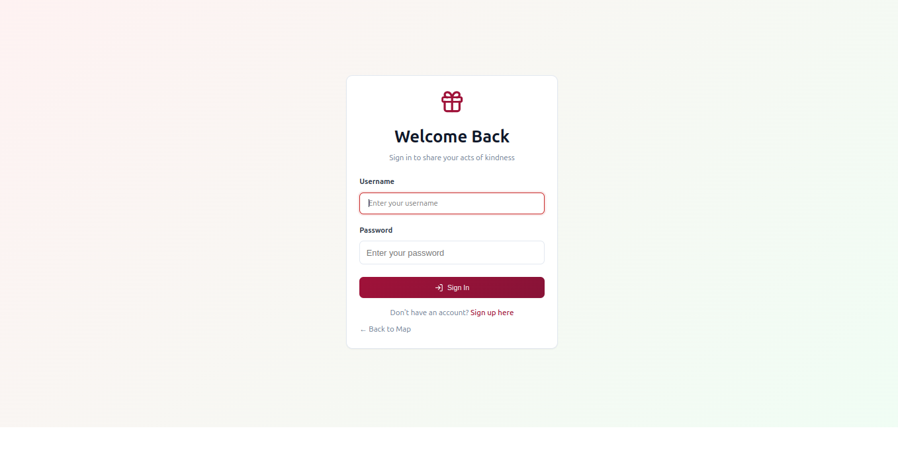
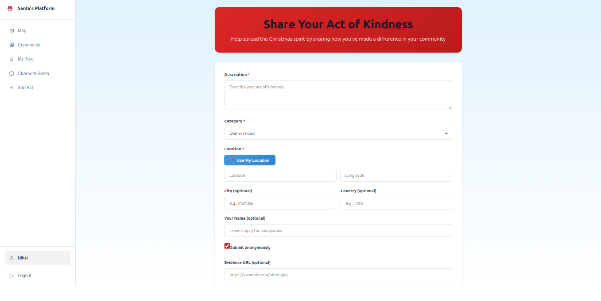
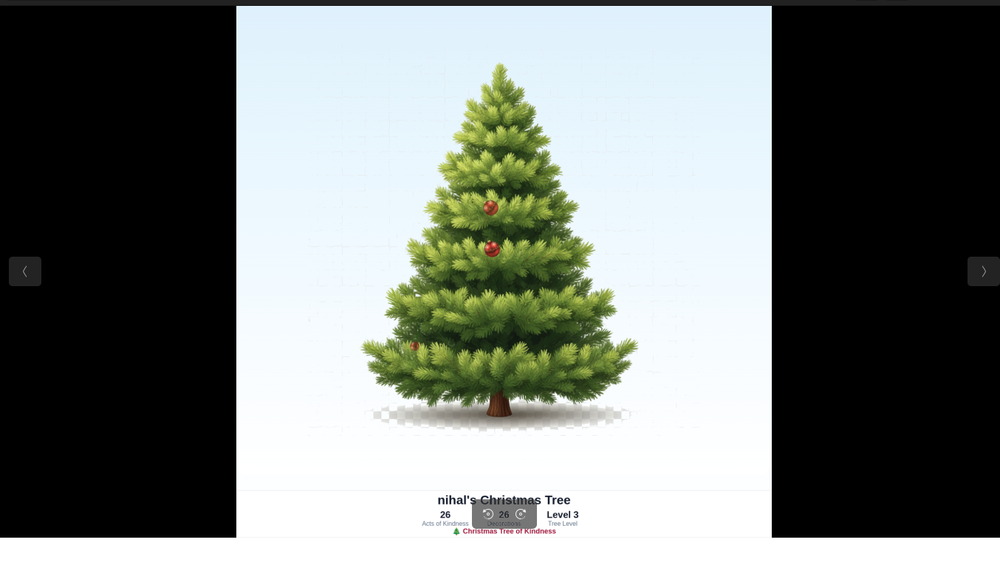
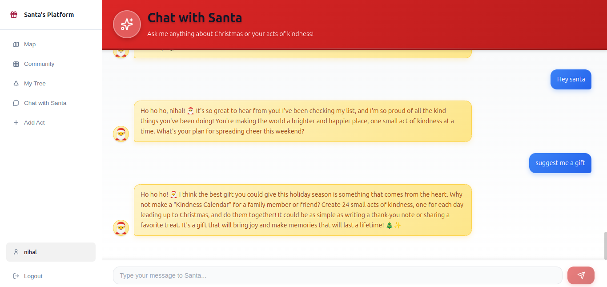
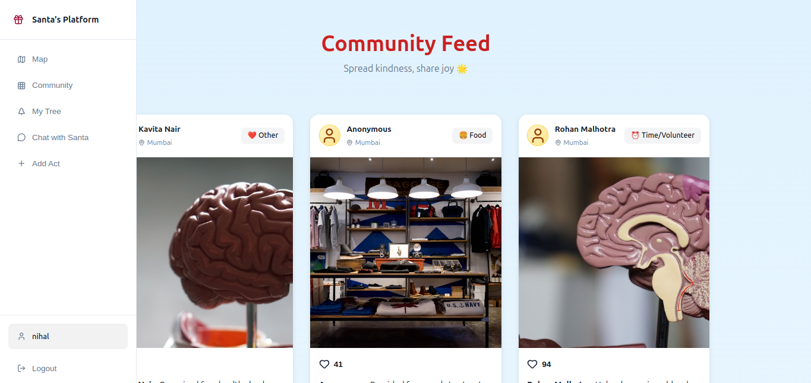
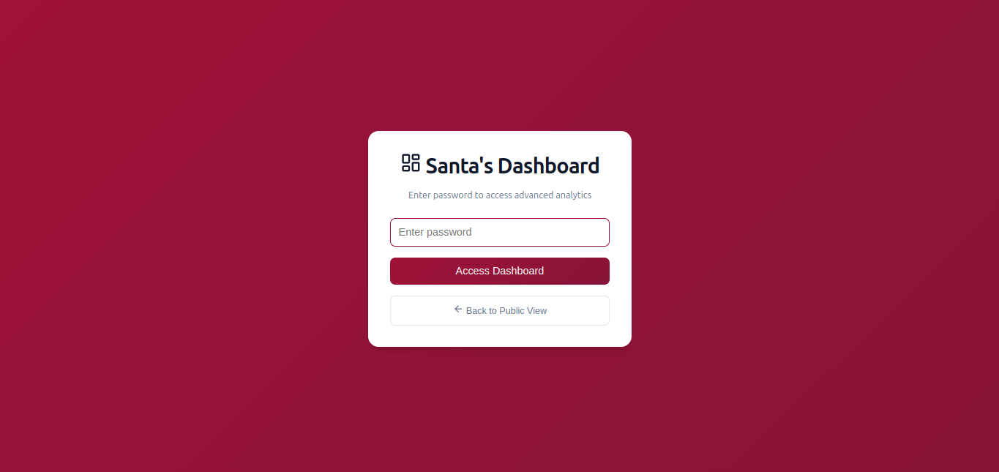
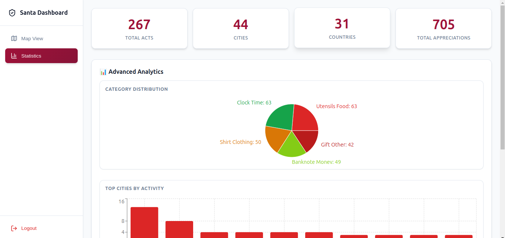

# 🎄 Christmas Tree of Kindness

A gamified web application that encourages acts of kindness by allowing users to build and decorate their own virtual Christmas tree. Each act of kindness adds decorations to the tree, creating a beautiful visual representation of generosity and compassion.


## 📖 Project Description

Christmas Tree of Kindness is a full-stack web application that gamifies acts of kindness. Users can submit acts of kindness they've performed, and each submission unlocks decorations on their personalized Christmas tree. The application features:

- **Interactive Map Visualization**: View all acts of kindness on a global map with heat mapping
- **Personalized Christmas Trees**: Each user has their own tree that grows and decorates as they perform more acts
- **Progress Tracking**: Milestone-based progress system with tree levels (1-5)
- **AI-Powered Chat**: Chat with Santa using AI to get advice and encouragement
- **Community Feed**: Instagram-style feed showcasing acts of kindness with images
- **Admin Dashboard**: Comprehensive analytics and data management tools
- **Beautiful UI**: Modern, responsive design with smooth interactions

## 🎅 How This Platform Helps Santa

Santa's Workshop has never been more efficient! This platform empowers Santa (administrators) with powerful tools to monitor, analyze, and celebrate acts of kindness happening around the world.

### 🌍 Global Visibility
- **Worldwide Monitoring**: See all acts of kindness happening across the globe in real-time on an interactive map
- **Heat Mapping**: Identify regions with high activity and areas that need more encouragement
- **Geographic Insights**: Understand where kindness is spreading and track global impact

### 📊 Data-Driven Decision Making
- **Comprehensive Analytics**: Access detailed statistics including total acts, cities, countries, and user engagement
- **Category Analysis**: Understand which types of kindness (Food, Clothing, Time, Money, Other) are most common
- **Trend Identification**: Track patterns over time to see how the community grows
- **Regional Statistics**: Identify top cities and countries where kindness is flourishing

### 🎯 Community Management
- **User Engagement Tracking**: Monitor how many users are actively participating
- **Appreciation Metrics**: See how the community appreciates each other's acts
- **Growth Monitoring**: Track the platform's growth and user adoption rates
- **Content Moderation**: View all submitted acts with images and descriptions

### 📈 Strategic Planning
- **Export Capabilities**: Download data in CSV or JSON format for further analysis
- **Performance Metrics**: Measure the platform's impact and effectiveness
- **Resource Allocation**: Identify where to focus efforts based on geographic and category data
- **Campaign Planning**: Use insights to plan future initiatives and challenges

### 🤖 AI-Powered Assistance
- **Chat Analytics**: Monitor conversations between users and AI Santa
- **Engagement Insights**: Understand what users are asking about and how Santa can help
- **Personalized Support**: Track how Santa's AI responses are helping users

### 🎁 Impact Measurement
- **Total Acts Tracking**: See the cumulative impact of all acts of kindness
- **Community Growth**: Monitor how the community expands over time
- **Success Stories**: Identify and celebrate the most impactful acts
- **Global Reach**: Track how many countries and cities are participating

### 🔒 Secure Administration
- **Password-Protected Access**: Secure dashboard ensures only authorized personnel can access sensitive data
- **Session Management**: Persistent login for convenient access
- **Data Privacy**: All user data is protected and managed securely

With these powerful tools, Santa can efficiently manage the global network of kindness, make data-driven decisions, and ensure that the spirit of giving continues to spread worldwide! 🎄✨

## ✨ Features

### 🏠 Home Page - Interactive Map

The home page features a global interactive map powered by Leaflet that displays all acts of kindness submitted by users worldwide.

**Key Features:**
- **Heat Map Visualization**: See density of acts across different regions
- **Interactive Markers**: Click on any location to view nearby acts
- **Advanced Filtering**: 
  - Search by location (city/country) or description
  - Filter by category (Food, Clothing, Time, Money, Other)
  - Filter by time period (Today, This Week, This Month, All Time)
- **Act Details Panel**: Click on map locations to see detailed information about acts
- **Real-time Statistics**: View total acts, cities, and countries in the header
- **Responsive Design**: Works seamlessly on desktop and mobile devices

**Screenshot:**

*The interactive world map showing acts of kindness with heat visualization and filtering options*

---

### 🔐 User Authentication

Secure user registration and login system to personalize the experience.

#### Registration Page

**Features:**
- Username and password creation
- Optional email, first name, and last name
- Password confirmation validation
- Minimum 6 character password requirement
- Beautiful, user-friendly form design

**Screenshot:**

*User registration form with validation*

#### Login Page

**Features:**
- Secure username/password authentication
- Error handling for invalid credentials
- Redirect to intended page after login
- Link to registration for new users
- Quick navigation back to map

**Screenshot:**

*User login interface*

---

### ➕ Add Act of Kindness

Submit your acts of kindness to unlock decorations on your tree.

**Features:**
- **Category Selection**: Choose from Food, Clothing, Time, Money, or Other
- **Location Picker**: 
  - Automatic geolocation detection
  - Manual location search
  - Map-based location selection
- **Description Field**: Describe your act of kindness
- **Image Upload**: Upload evidence/photo of your act (optional)
- **Form Validation**: Ensures all required fields are filled
- **Auto-Decoration**: Tree automatically receives a decoration when act is submitted
- **Success Feedback**: Redirects to tree page to see new decoration

**Screenshot:**

*Form to submit acts of kindness with location picker and image upload*

---

### 🎄 My Tree Page - Personalized Christmas Tree

Your personal Christmas tree that grows and decorates as you perform acts of kindness.

#### Tree Display

**Features:**
- **5 Tree Levels**: Tree grows from level 1 to 5 based on total acts
  - Level 1: 1-10 acts
  - Level 2: 11-25 acts
  - Level 3: 26-50 acts
  - Level 4: 51-100 acts
  - Level 5: 100+ acts
- **Multiple Decoration Types**:
  - 🎁 Colored Ornaments (unlocked at 3 acts)
  - ⭐ Star Topper (unlocked at 5 acts)
  - 💡 Lights (unlocked at 10 acts)
  - 🎀 Garland (unlocked at 15 acts)
  - ❄️ Snowflakes (unlocked at 25 acts)
  - ✨ Golden Ornaments (unlocked at 50 acts)
  - 🌟 Special Tree Topper (unlocked at 100 acts)
- **Progress Tracking**: Visual progress bar showing next milestone
- **Decoration Count**: See total decorations on your tree
- **Tree Statistics**: View total acts and current tree level

**Screenshot:**

*Personalized Christmas tree with decorations unlocked by acts of kindness*

#### Edit Mode

**Features:**
- **Drag & Drop**: Rearrange decorations by dragging them to desired positions
- **Visual Feedback**: Decorations highlight when draggable
- **Save/Cancel**: Save changes or cancel to revert
- **Real-time Preview**: See changes before saving
- **Position Persistence**: Your custom layout is saved

**Screenshot:**

*Edit mode showing drag and drop functionality for customizing tree decorations*

#### Export & Share

**Features:**
- **Download Tree Image**: Export your tree as a PNG image
- **Share Tree**: 
  - Native share API support (mobile)
  - Copy link to clipboard (desktop)
  - Share with tree statistics
- **Image Customization**: Includes username and tree stats in exported image
- **Refresh Button**: Reload tree data

**Screenshot:**

*Export and share options for your Christmas tree*

#### Progress Tracking

**Features:**
- **Milestone Display**: See all milestones and unlock requirements
- **Progress Bar**: Visual indicator of progress to next milestone
- **Next Goal**: Clear indication of what's needed for next decoration
- **Achievement Badges**: Visual representation of unlocked decorations

**Screenshot:**

*Progress tracking showing milestones and next goals*

---

### 💬 Chat with Santa

AI-powered chat feature to interact with Santa about Christmas and acts of kindness.

**Features:**
- **AI Conversations**: Chat with Santa using advanced AI models
- **Chat History**: All conversations are saved and persist across sessions
- **Contextual Responses**: Santa provides personalized advice based on your acts
- **Welcome Messages**: Friendly greetings when starting a new chat
- **Message History**: View all previous conversations
- **Real-time Typing Indicators**: See when Santa is typing
- **Protected Route**: Requires authentication to access

**Screenshot:**

*AI-powered chat interface with Santa*

---

### 📸 Community Feed

Instagram-style feed showcasing acts of kindness from the community.

**Features:**
- **Image Gallery**: View acts with uploaded images in a card-based layout
- **User Information**: See username and location for each act
- **Category Badges**: Visual category indicators with emojis
- **Appreciation Count**: See how many people appreciated each act
- **Time Stamps**: Relative time display (Today, Yesterday, X days ago)
- **Responsive Grid**: Beautiful card layout that adapts to screen size
- **Empty State**: Encouraging message when no acts are available
- **Error Handling**: Graceful error messages with retry options

**Screenshot:**

*Instagram-style feed of community acts of kindness*

---

### 🎅 Santa Dashboard - Admin Panel

Password-protected admin dashboard for comprehensive analytics and management.

#### Authentication

**Features:**
- **Password Protection**: Secure password-based authentication
- **Session Management**: Persistent login across page refreshes
- **Logout Functionality**: Secure logout option
- **Access Control**: Only authorized users can access dashboard

**Screenshot:**

*Password-protected admin dashboard login*

#### Map View

**Features:**
- **Interactive Map**: Same map interface as home page with admin controls
- **All Acts Display**: View all submitted acts of kindness
- **Filtering Options**: Same filtering capabilities as public map
- **Act Details**: Click to view detailed information
- **Analytics Sidebar**: Quick stats while viewing map
- **Export Options**: Export data directly from map view

**Screenshot:**

*Admin dashboard map view with filtering and analytics*

#### Statistics View

**Features:**
- **Overview Cards**: 
  - Total Acts
  - Total Cities
  - Total Countries
  - Total Appreciations
- **Analytics Panel**: 
  - Category distribution charts
  - Regional statistics
  - Time-based trends
  - Top cities and countries
- **Data Export**: 
  - Export to CSV
  - Export to JSON
  - Include all act data
  - Include statistics
- **Navigation**: Switch between map and stats views

**Screenshot:**

*Admin dashboard statistics view with analytics and export options*

#### Analytics Panel

**Features:**
- **Category Distribution**: Pie/bar charts showing act categories
- **Geographic Analysis**: Top cities and countries
- **Time Analysis**: Acts over time trends
- **User Statistics**: User engagement metrics
- **Visual Charts**: Interactive charts using Recharts

**Screenshot:**

*Detailed analytics with charts and visualizations*

---

### 📊 Santa Stats Page

Dedicated statistics page with comprehensive analytics.

**Features:**
- **Comprehensive Statistics**: All metrics in one place
- **Advanced Analytics**: Deep dive into data
- **Export Functionality**: Download data in multiple formats
- **Map Navigation**: Quick link to map view
- **Same Authentication**: Password-protected like dashboard

**Screenshot:**

*Dedicated statistics page with comprehensive analytics*

---

### 🗺️ Act Details View

Detailed view of acts when clicking on map locations.

**Features:**
- **Act Information**: 
  - Description
  - Category
  - Location (city, country)
  - Date submitted
  - User information
- **Nearby Acts**: Shows other acts in the same area
- **Location Display**: Map coordinates and address
- **Close Button**: Easy dismissal of details panel
- **Responsive Design**: Works on all screen sizes

**Screenshot:**

*Detailed view of acts of kindness with location and nearby acts information*

---

## 🛠️ Tech Stack

### Backend
- **Django 4.2.7**: Python web framework
- **Django REST Framework 3.14.0**: Building RESTful APIs
- **Django CORS Headers 4.3.1**: Handling CORS for frontend communication
- **Python 3.12+**: Programming language
- **SQLite**: Database (can be easily migrated to PostgreSQL)

### Frontend
- **React 19.2.3**: UI library
- **Vite 6.4.1**: Build tool and dev server
- **React Router DOM 6.30.2**: Client-side routing
- **Axios 1.13.2**: HTTP client for API requests
- **Leaflet 1.9.4**: Interactive maps
- **Leaflet.heat 0.2.0**: Heat map visualization
- **Recharts 3.6.0**: Data visualization and charts
- **Lucide React 0.562.0**: Icon library
- **CSS3**: Custom styling with CSS variables

### Development Tools
- **Git**: Version control
- **Vite**: Fast build tool and HMR
- **ESLint**: Code linting

## 📸 Screenshots Directory

All screenshots should be placed in the `screenshots/` directory with the following naming convention:

1. `home-page-map.png` - Interactive map view showing acts of kindness
2. `registration-page.png` - User registration form
3. `login-page.png` - User login interface
4. `add-act-form.png` - Form to submit acts of kindness
5. `my-tree.png` - Personalized Christmas tree with decorations
6. `edit-mode.png` - Edit mode showing drag and drop functionality
7. `tree-export.png` - Export and share options
8. `progress-tracking.png` - Progress tracking and milestones
9. `chat-with-santa.png` - AI chat interface
10. `community-feed.png` - Instagram-style community feed
11. `dashboard-login.png` - Admin dashboard password screen
12. `santa-dashboard-map.png` - Admin dashboard map view
13. `santa-dashboard-stats.png` - Admin dashboard statistics view
14. `analytics-panel.png` - Analytics panel with charts
15. `santa-stats.png` - Dedicated statistics page
16. `act-details.png` - Detailed view of an act of kindness

**Screenshot Guidelines:**
- Use PNG format for better quality
- Recommended dimensions: 1920x1080 or 1600x900
- Crop to show the most important UI elements
- Ensure text is readable
- Use consistent styling across screenshots

## 🚀 Setup Instructions

### Prerequisites
- Python 3.12 or higher
- Node.js 18+ and npm
- Git

### Backend Setup

1. **Clone the repository**
   ```bash
   git clone <repository-url>
   cd christmas
   ```

2. **Create and activate virtual environment**
   ```bash
   cd backend
   python3 -m venv venv
   source venv/bin/activate  # On Windows: venv\Scripts\activate
   ```

3. **Install dependencies**
   ```bash
   pip install -r requirements.txt
   ```

4. **Run migrations**
   ```bash
   python manage.py migrate
   ```

5. **Create superuser (optional, for admin access)**
   ```bash
   python manage.py createsuperuser
   ```

6. **Run the development server**
   ```bash
   python manage.py runserver
   ```
   The backend API will be available at `http://localhost:8000`

### Frontend Setup

1. **Navigate to frontend directory**
   ```bash
   cd ../frontend
   ```

2. **Install dependencies**
   ```bash
   npm install
   ```

3. **Start the development server**
   ```bash
   npm run dev
   ```
   The frontend will be available at `http://localhost:3000`

### Configuration

The backend is configured to accept requests from `http://localhost:3000` by default. If you need to change this, update the `CORS_ALLOWED_ORIGINS` and `CSRF_TRUSTED_ORIGINS` in `backend/santa_project/settings.py`.

### Build for Production

**Frontend:**
```bash
cd frontend
npm run build
```
The built files will be in the `frontend/build/` directory.

**Backend:**
For production, configure:
- Set `DEBUG = False` in settings.py
- Use a production database (PostgreSQL recommended)
- Set up proper static file serving
- Configure environment variables for SECRET_KEY

## 📁 Project Structure

```
christmas/
├── backend/                 # Django backend
│   ├── acts/               # Acts of kindness app
│   ├── user_auth/          # User authentication
│   ├── tree/               # Tree and decorations logic
│   ├── chat/               # AI chat functionality
│   ├── admin_auth/         # Admin authentication
│   ├── santa_project/      # Django project settings
│   ├── manage.py
│   └── requirements.txt
│
├── frontend/               # React frontend
│   ├── src/
│   │   ├── components/     # React components
│   │   │   ├── Auth/       # Authentication components
│   │   │   ├── Dashboard/  # Dashboard components
│   │   │   ├── Filters/    # Filter components
│   │   │   ├── Forms/      # Form components
│   │   │   ├── Layout/     # Layout components
│   │   │   ├── Map/        # Map components
│   │   │   ├── Navigation/ # Navigation components
│   │   │   ├── Sidebar/    # Sidebar components
│   │   │   └── Tree/       # Tree components
│   │   ├── pages/          # Page components
│   │   ├── services/       # API services
│   │   ├── contexts/       # React contexts
│   │   └── utils/          # Utility functions
│   ├── public/             # Static assets
│   │   └── assets/         # Tree and decoration images
│   ├── package.json
│   └── vite.config.js
│
├── screenshots/             # Application screenshots
├── README.md
└── DEPLOYMENT.md
```

## 🔑 API Endpoints

### Authentication
- `POST /api/auth/register/` - User registration
- `POST /api/auth/login/` - User login
- `POST /api/auth/logout/` - User logout

### Acts
- `GET /api/acts/` - List all acts (with filters)
- `POST /api/acts/` - Create new act
- `GET /api/acts/stats/` - Get statistics
- `GET /api/acts/nearby/` - Get nearby acts
- `GET /api/acts/region/` - Get region data
- `GET /api/acts/community/` - Get community feed acts

### Tree
- `GET /api/tree/my-tree/` - Get user's tree
- `GET /api/tree/decorations/` - List decorations
- `PUT /api/tree/decorations/{id}/` - Update decoration position
- `POST /api/tree/decorations/` - Create decoration

### Chat
- `GET /api/chat/history/` - Get chat history
- `POST /api/chat/send/` - Send message to Santa

### Admin
- `POST /api/admin/check-password/` - Admin password check
- `GET /api/admin/dashboard/` - Dashboard data

## 🎮 Usage Guide

### For Users

1. **Register/Login**: Create an account or login to get started
2. **Submit Acts**: Click "Add Act" to submit your acts of kindness
   - Choose a category
   - Select or search for location
   - Add description and optional image
   - Submit to unlock decorations
3. **View Map**: Browse the interactive map to see acts from around the world
   - Use filters to find specific acts
   - Click on locations to see details
4. **Build Your Tree**: Each act unlocks decorations on your tree
   - View your tree on "My Tree" page
   - See progress and milestones
5. **Customize Tree**: Use Edit Mode to drag decorations to your preferred positions
   - Click "Edit" button
   - Drag decorations around
   - Click "Save" to apply changes
6. **Export & Share**: Download your tree as an image or share it
7. **Chat with Santa**: Get advice and encouragement from AI Santa
8. **Community Feed**: Browse acts from other users with images

### For Admins

1. **Access Dashboard**: Navigate to `/santa-dashboard`
2. **Enter Password**: Use the admin password to access
3. **View Map**: See all acts on the interactive map
4. **View Statistics**: Switch to stats view for analytics
5. **Export Data**: Download data in CSV or JSON format
6. **Analyze Trends**: Use analytics panel to understand patterns

## 🎯 Key Features Summary

### User Features
- ✅ Secure user authentication (register/login)
- ✅ Submit acts of kindness with location and images
- ✅ Interactive global map with heat visualization
- ✅ Personalized Christmas tree with 5 levels
- ✅ 7 types of decorations unlocked by milestones
- ✅ Drag & drop tree customization (edit mode)
- ✅ Tree image export and sharing
- ✅ Progress tracking with milestones
- ✅ AI-powered chat with Santa
- ✅ Community feed (Instagram-style)
- ✅ Search and filter acts
- ✅ Act details and nearby acts view

### Admin Features
- ✅ Password-protected dashboard
- ✅ Interactive map with all acts
- ✅ Comprehensive statistics and analytics
- ✅ Category distribution charts
- ✅ Geographic analysis (cities, countries)
- ✅ Data export (CSV, JSON)
- ✅ Time-based filtering
- ✅ Search functionality

## 🗺️ Roadmap

Potential future features:
- [ ] Tree image export/sharing improvements
- [ ] Public tree gallery
- [ ] Social features (friends, leaderboards)
- [ ] Achievement badges system
- [ ] Daily challenges
- [ ] Tree themes/customization options
- [ ] Mobile app (React Native)
- [ ] Email notifications
- [ ] Push notifications
- [ ] Multi-language support
- [ ] Advanced analytics for users
- [ ] Tree comparison features

## 📝 License

This project is part of a hackathon submission. Please check the license file for details.

## 👥 Contributors

- Your Name/Team

## 🙏 Acknowledgments

- Django and React communities
- Leaflet for map functionality
- Recharts for data visualization
- All the open-source libraries that made this possible

---

Made with ❤️ and 🎄 for spreading kindness around the world!
